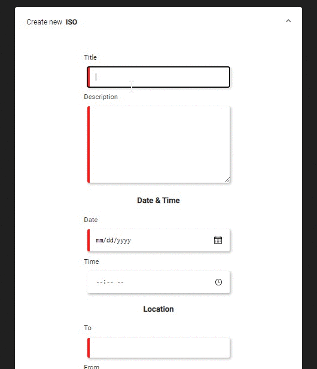

# **favor** *[do-favor.web.app](https://do-favor.web.app)*

Favor is a way to connect students in the **right place** at the **right time** to help their peers in need

- **3rd place** at [CornHacks 2020](https://cornhacks-2020.devpost.com/), a hackathon focused on projects promoting sustainable practices
- **Devpost**: https://devpost.com/software/favor-yn7uqo
- **Technologies**: Angular, Firebase for authentication and a database, SCSS for styling, and the the Google Maps API

| <a href="https://sampsonjacob.com" target="_blank">**Jacob Sampson**</a> | <a href="https://github.com/LukeAVanDrie" target="_blank">**Luke VanDrie**</a> | <a href="https://github.com/patlm" target="_blank">**Patrick Murphy**</a> |
| :----------------------------------------------------------: | :----------------------------------------------------------: | :----------------------------------------------------------: |
|  |  |  |
| <a href="http://github.com/JacobSampson" target="_blank">`github.com/JacobSampson`</a> | <a href="http://github.com/LukeVanDrie" target="_blank">`github.com/LukeVanDrie`</a> | <a href="http://github.com/patlm" target="_blank">`github.com/patlm`</a> |

---

## Features

 

 

### Opportunities

Users can post *Opportunities* where they are are able to fulfill requests
- *e.g. Visiting the store, donating old furniture, driving back to a home state*

### ISO

Users can post *ISOs* (In Search Of) if looking for a service or producr
- *e.g. Need something from the store, looking for old equitpment or book, needing a ride*

### Account

Users can view the *Opportunities* they created and the *ISOs* they are fulfilling

## Inspiration
We are all part of several large group chats, and it is not uncommon for a student to ask for a favor. We wanted to consolidate this behavior into a campus-wide system that is inclusive of all students who might not have the same large social networks that other students may have. We also felt that many of the errands that college students run result in redundancy relative to time and transportation emissions. By allowing students to easily request favors and communicate when they are going on these errands, we can drastically cut down on the amount of unnecessary trips that students must take. Finally, everyone likes an opportunity to get paid. Not only did we want to give students back their time by consolidating trips, the students making these trips can earn a little bit of extra cash by assisting their peers in need.

## Impact
Our web-app, favor, enables student to connect with each other and assist each other with various tasks. There are two main aspects of our application: the ISO page and the opportunity page. The ISO page allows users to make post for tasks that they are seeking out help with in exchange for money. Other users can then fulfill these requests. This then sends the request to each user's landing page where they can monitor its progress. Then there is the opportunity page which allows students who are already intending on completing tasks to reach out to other students who could benefit from their actions. A student posts the action they intend on performing at a designated time, and other users can add comments onto their post, indicating that they are interested in a favor. By enabling students to help each other accomplish even the smallest tasks through our application, we are cutting down on emissions through redundant transportation as well as building new social bonds.

## Technology
We started building our project by propping up a firebase database with built in Google Authentication as a placeholder for a user API. Then we started structuring our page layout and building shared components that we could then populate with firebase data retrieved through our service class. The rest of the project time was spent polishing and implementing minor details of the web-app.

<!-- ## License -->

<!-- 

- **[MIT license](http://opensource.org/licenses/mit-license.php)**
- Copyright 2015 © <a href="http://fvcproductions.com" target="_blank">FVCproductions</a>. -->